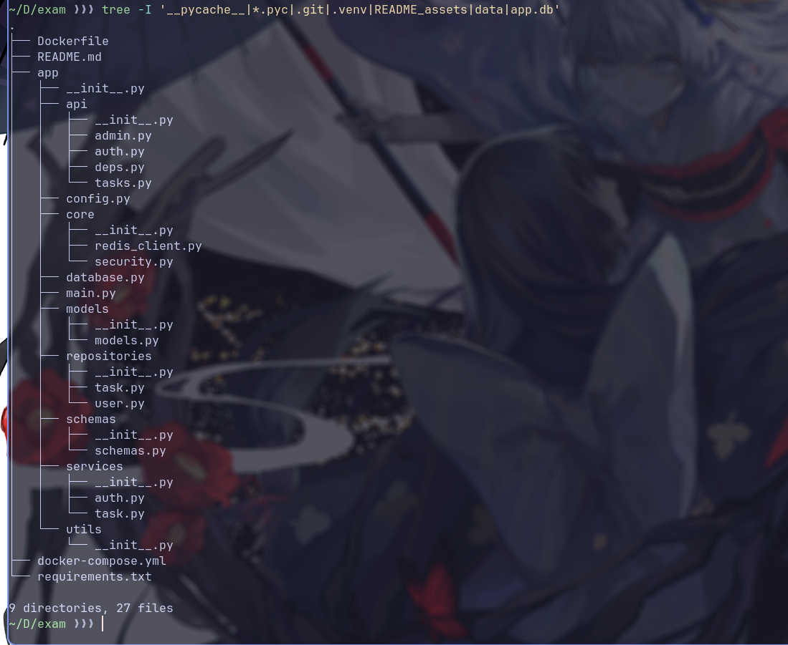

# Task Tracker API

REST API для управления задачами с регистрацией, JWT-аутентификацией, ролевой моделью и кэшированием через Redis.

## Стек технологий

- FastAPI (Python 3.12)
- PostgreSQL 15
- SQLAlchemy 2.0 (async)
- Redis 7
- JWT (python-jose)
- bcrypt (passlib)
- Pydantic v2
- Docker / Docker Compose

## Структура проекта

## Запуск через Docker Compose

1. Убедиться, что установлены Docker и Docker Compose.
2. Клонировать репозиторий:

git clone https://github.com/DarkUser1onion/exam.git
cd exam

3. Запустить контейнеры:

docker-compose up --build

4. После успешного запуска Swagger UI доступен по адресу:
http://localhost:8000/docs

## Учетные записи по умолчанию

При первом запуске автоматически создается администратор:

- Логин: `admin`
- Пароль: `Admin123`

Обычные пользователи создаются через эндпоинт регистрации.

## Основные эндпоинты API

### Аутентификация

| Метод | Путь           | Описание                              |
|-------|----------------|-------------------------------------------------------------|
| POST  | /auth/register | Регистрация нового пользователя       |
| POST  | /auth/login    | Получение JWT (access token)          |
| GET   | /auth/me       | Информация о текущем пользователе     |

### Задачи

| Метод | Путь          | Описание                               |
|------|----------------|-----------------------------------------------------------------------|
| POST  | /tasks/       | Создание новой задачи                      |
| GET   | /tasks/       | Список задач текущего пользователя         |
| GET   | /tasks/{id}   | Получение задачи по идентификатору         |
| PATCH | /tasks/{id}   | Частичное обновление задачи                |
| DELETE| /tasks/{id}   | Удаление задачи                            |

Список задач кэшируется в Redis (TTL 60 секунд).

### Администрирование (только роль `admin`)

| Метод | Путь          | Описание                |
|------|----------------|-------------------------------|
| GET   | /admin/users  | Список всех пользователей |

## Переменные окружения

Настройки приложения задаются через переменные окружения (в `docker-compose.yml` или `.env`):

| Переменная                 | Назначение                       | Значение по умолчанию                     |
|-----------------------------|------------------------------------|------------------------------------------------------------------|
| DATABASE_URL               | Строка подключения к БД          | postgresql://postgres:postgres@db/exam_db |
| REDIS_URL                  | Адрес Redis                      | redis://redis:6379/0                      |
| SECRET_KEY                 | Ключ для подписи JWT             | change_this_in_production_123!             |
| ACCESS_TOKEN_EXPIRE_MINUTES| Время жизни access токена (мин)  | 60                                         |
